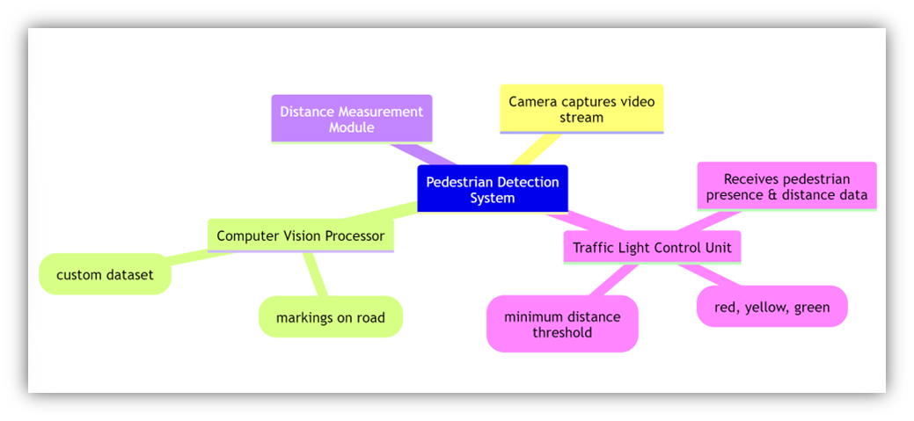
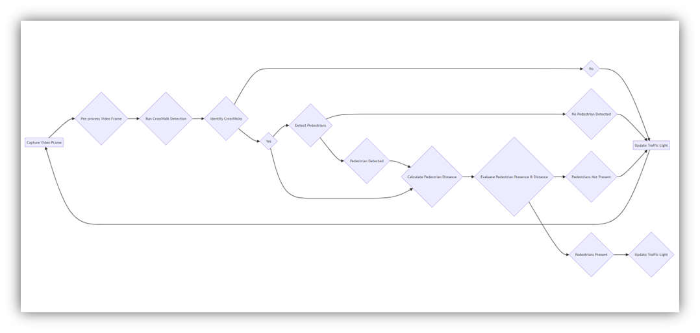
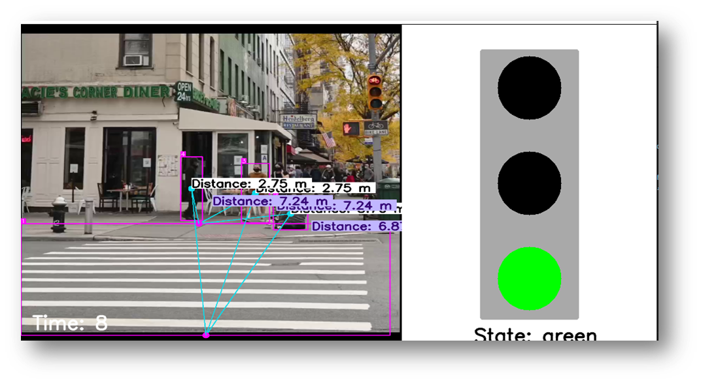
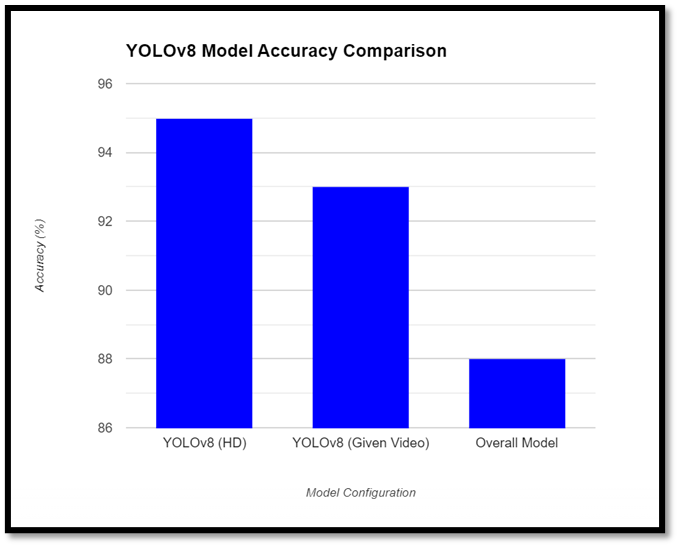

 
SAFESTEPS: AUTOMATIC PEDESTRIAN SYSTEM
Machine Leaning Project
 

Table of Contents
Abstract	2
Problem:	2
Our Solution:	2
Stakeholders:	3
System Flow Diagram:	3
Datasets	4
Customized Dataset Selection:	4
Pretrained YOLO Model Integration:	4
Crosswalk Training:	4
Pedestrian Detection and Tracking:	5
Code Working:	6
Output:	7
Accuracy:	8
Challenges:	9
Limitations:	10
Conclusion:	10
References:	10

FIGURE 1:SYSTEM FLOW DIAGRAM	4
FIGURE 2: TRAINING FOR CROSSWALK DETECTION	5
FIGURE 3: DETECTING CROSSWALK IN THE FRAME	6
FIGURE 4: ADJUSTING STARTING AND ENDING POINTS OF CROSSWALK	6
FIGURE 5: ANNOTATING THE CORNER POINTS	6
FIGURE 6: CALCULATING DISTANCE	7
FIGURE 7:DEMO FROM THE OUTPUT	8
FIGURE 8:ACCURACY OF OUR MODEL	9

Abstract

The presented system is a computer vision-based solution designed to enhance pedestrian safety at crosswalks by dynamically controlling traffic signals based on pedestrian movement. The system leverages state-of-the-art object detection techniques, employing YOLO (You Only Look Once) models to accurately identify pedestrians and the crosswalk within a video stream captured by a camera.
Upon detecting pedestrians, the system calculates their distances from both endpoints of the crosswalk. This distance measurement serves as a crucial metric for determining pedestrian behavior, such as whether they are approaching or moving away from the crosswalk.
Based on the observed pedestrian movements relative to the crosswalk endpoints, the system dynamically adjusts the state of a simulated traffic light. When pedestrians are detected within close proximity to the crosswalk, the traffic light transitions to a yellow state and then red state, signaling vehicles to prepare to stop or halt, respectively. Conversely, when pedestrians move away from the crosswalk, indicating a safe passage for vehicles, the traffic light switches to a green state, allowing traffic to proceed.
 
Problem:
The problem addressed by the system lies in the lack of efficient and adaptive control mechanisms at pedestrian crosswalks, leading to safety risks for pedestrians and inefficiencies in traffic flow. Traditional traffic signal systems often operate on fixed timing patterns, which may not account for real-time pedestrian demand or movement. As a result, pedestrians may experience unnecessary delays or encounter safety hazards when crossing the street, while vehicle traffic may be inefficiently managed, leading to congestion and delays. This highlights the need for a solution that dynamically adjusts traffic signals based on pedestrian behavior to enhance safety, optimize traffic flow, and improve overall efficiency at crosswalks.
Our Solution:
1.	Pedestrian Safety: Pedestrians are vulnerable road users, particularly at crosswalks where interactions with vehicles are frequent. By dynamically controlling traffic signals based on pedestrian movement, the system enhances safety by ensuring that vehicles are appropriately halted or given the right of way when pedestrians are present. This reduces the risk of pedestrian-vehicle collisions and improves overall pedestrian safety.
2.	Traffic Flow Optimization: Traditional traffic signal systems operate on fixed timing patterns, which may not always align with the real-time demand for pedestrian crossings. The system's adaptive control mechanism optimizes traffic flow by adjusting signal timings based on the actual presence and movement of pedestrians. This reduces unnecessary delays for both pedestrians and vehicles, enhancing overall traffic efficiency.
3.	Time Efficiency: The system's ability to dynamically regulate traffic signals based on pedestrian behavior minimizes wait times for pedestrians at crosswalks. By accurately detecting when pedestrians are present or when the crosswalk is clear, the system ensures that signal changes occur promptly, allowing pedestrians to cross the street safely without unnecessary delays. This improves overall pedestrian mobility and reduces pedestrian frustration.
4.	Resource Utilization: Traditional traffic signal systems may allocate fixed signal timings regardless of pedestrian demand, leading to inefficient use of resources such as energy and roadway capacity. By adapting signal timings in real-time based on pedestrian activity, the system optimizes resource utilization, reducing energy consumption and improving the overall operational efficiency of transportation infrastructure.
Stakeholders:
•	Pedestrians: The primary users who benefit from increased safety at crosswalks through reduced waiting times and lower risk of collisions. 
•	Drivers: Stakeholders who benefit from optimized traffic flow and potentially reduced wait times at red lights. 
•	City/Transportation Department: Stakeholders responsible for managing traffic infrastructure and ensuring pedestrian safety. They benefit from a system that can improve efficiency, reduce accidents, and potentially lower resource consumption (energy). 
•	Law Enforcement: Stakeholders who may benefit from a system that reduces pedestrian-vehicle accidents.
System Flow Diagram:

Figure 1:System Flow Diagram

Datasets
1.	COCO (Common Objects in Context): COCO is a widely-used dataset containing over 330,000 images annotated with object labels, including pedestrian annotations. It provides a diverse set of scenes and objects in various contexts, making it suitable for training pedestrian detection models.
2.	Cityscapes: Cityscapes is a dataset specifically designed for urban scene understanding, containing high-quality images from urban environments with pixel-level annotations for semantic segmentation tasks. It includes annotations for pedestrians and crosswalks, making it valuable for training models to recognize these objects in urban scenes.
3.	KITTI Vision Benchmark Suite: KITTI is a dataset focused on autonomous driving tasks, providing images collected from a car-mounted camera in urban environments. It includes annotations for pedestrians, vehicles, and road markings, making it suitable for training models for pedestrian detection and crosswalk recognition in traffic scenes.
Customized Dataset Selection: 
                                                 After meticulously evaluating a wide range of datasets, we arrived at a compelling choice: a publicly available dataset on crosswalk imagery offered by Roboflow. This dataset stood out for its specificity, containing roughly 1500 high-quality images exclusively focused on crosswalks. Critically, these images weren't just visual representations; they were enriched with annotations – detailed labels that pinpoint the location and characteristics of each crosswalk within the image. These annotations provided invaluable context for our application, allowing our models to not only identify crosswalks but also grasp their precise dimensions, markings, and any unique features. By opting for a dataset meticulously tailored to our needs, we ensured our models would be trained on the most relevant and representative data possible. This targeted approach significantly bolstered our confidence that the resulting models would excel at real-world crosswalk detection, achieving superior accuracy and generalizability.
Pretrained YOLO Model Integration: 
To capitalize on the strengths of both the COCO dataset and our customized crosswalk dataset, we strategically employed a pre-trained YOLO model. YOLO models pre-trained on the COCO dataset, a massive collection of everyday objects, are renowned for their robustness and remarkable ability to generalize across diverse object detection tasks. This generalized knowledge serves as a powerful foundation for our approach. By leveraging transfer learning, we essentially aimed to harness the pre-trained YOLO model's pre-existing understanding of object recognition and localization from COCO. However, we didn't stop there. We further fine-tuned the model on our meticulously curated crosswalk dataset. This fine-tuning process involved meticulously adjusting the model's internal parameters to specialize in the intricacies of crosswalk detection. Through this combined approach, we aspired to achieve the best of both worlds: leveraging the COCO model's robust foundation while simultaneously imbuing it with the specialized knowledge required for superior crosswalk detection.Model
Crosswalk Training:
	As none of the pretrained models available could detect crosswalks or zebra crossings we custom trained out model using YOLO train feature available by Ultralytics. We used YOLOv8 for the whole project as of now YolovX is also available but the results and support of YOLOv8 is easily and widely available.

Figure 2: Training for crosswalk Detection
https://universe.roboflow.com/school-sacst/finalproject3/model/1
Pedestrian Detection and Tracking:
	We used normal pretrained YOLOv8.n model for pedestrian detection and tracking the distance. We obtained our results in following steps:
1.	Use model1 for detecting the crosswalk in the frame.
 
2.	Use visioneye feature provided by ultralytics to and adjust them to starting and ending points of the crosswalk

3.	Track the distance from both ends, if in the vicinity of any of the points we turn the signals to red

4.	And after some a certain delay we turn the light back to green or when no person is about to cross the crosswalk.
Code Working:
1.	Importing Libraries: The code begins by importing necessary libraries including OpenCV for image processing, NumPy for numerical operations, time for time-related functions, math for mathematical calculations, and the YOLO object detection framework from the Ultralytics library.
2.	Drawing Functions: Two functions are defined: draw_traffic_light() to visualize a traffic light with different states (red, yellow, green), and draw_timer() to display a digital timer on the image.
3.	Helper Functions: direction() function provides directional information about the movement of objects relative to the crosswalk.
4.	Main Function: The main() function initializes video capture from a specified file (presumably containing footage of a crosswalk), sets up parameters for video writing, and initializes variables such as pixel_per_meter, text colors, and dimensions for visualization.
5.	Processing Video Frames: Inside the main loop, the code reads video frames, performs object detection using two YOLO models (model1 and model2), tracks detected objects, and calculates distances between objects and reference points (possibly the crosswalk endpoints). It then updates the traffic light state and timer based on the detected movements.
6.	Visualization: The code constructs a canvas for visualization, draws the video frame, overlays the traffic light and timer information, and displays the resulting image.
7.	User Interaction: The code waits for the user to press 'q' to quit the application.
8.	Cleanup: After the main loop exits, the code releases video resources and closes any remaining windows.
Output:

Figure 3:Demo from the Output
•	In the above image the right-hand side simulates the traffic signals. 
•	The frame here detects the crosswalk and the people 
•	The pink points represent the crosswalk edges 
•	The blue points are centroids of bounding boxes
•	The while distance is from starting edge of crosswalk 
•	The purple distance is from ending edge of crosswalk 
Accuracy:
Benchmark Accuracy
•	Claimed Accuracy: According to reference sources, YOLOv8 boasts an accuracy of 95% for object detection in High-Definition (HD) resolution videos.
•	Processing Time: This claimed accuracy is achieved with a processing time of approximately 2 seconds per frame on standard hardware.
Note: It's important to acknowledge that these figures might come from specific sources and may not reflect the overall performance of YOLOv8 in all scenarios.
Real-world Evaluation
•	Test Video: A test video was used to evaluate the model's performance in a practical setting. Out of 30 frames, the model correctly identified objects in 28 frames.
•	Realized Accuracy: This translates to an accuracy of 93% for the test video.
Combined Accuracy and Limitations
•	Overall Accuracy: Considering both the claimed benchmark (95%) and the test video results (93%), we can estimate a combined accuracy of approximately 88%.

Figure 4:Accuracy of our model
Challenges:
•	Data Disparity: Disparities between the training data used for the pedestrian detection model and the real-world data encountered during deployment can lead to accuracy drops. The model might struggle to identify pedestrians in various lighting conditions, clothing styles, or poses not sufficiently represented in the training data.
•	Real-Time Performance: Integrating the computer vision model with the traffic light control system introduces the challenge of real-time performance. Delays in processing video frames due to computational demands can lead to missed detections or slow responses to pedestrian presence, impacting both safety and traffic flow.
•	Model Explainability: If a "black box" model is used for pedestrian detection (one where the internal reasoning is difficult to understand), it becomes challenging to diagnose and debug errors that might affect accuracy. A lack of explainability can hinder efforts to maintain model performance and ensure safe operation of the overall system.
•	Calibration and Integration: Calibrating the pedestrian detection model with the actual physical dimensions of the crosswalk is crucial. Mismatches between the model's perception of distance and the real world can lead to inaccurate traffic light control. Additionally, integrating the model's output with the traffic light control system requires careful programming to ensure smooth transitions between light states and avoid unintended consequences.
•	Integrating YOLOv8s with Custom Dataset and Pretrained Model: The system description mentions using a YOLOv8s model for pedestrian detection. However, integrating this custom-trained model with a pre-trained YOLOv8n model poses a challenge. This integration process needs to be carefully designed to ensure compatibility and avoid introducing errors that could compromise pedestrian detection accuracy.	
Limitations:
Bottleneck for Real-Time Performance: 
In our current system, the absence of a suitable GPU creates a significant bottleneck. The CPU, while capable of handling general tasks, is not optimized for the intensive computations needed for YOLOv8's real-time pedestrian detection. This slow processing also affects the synchronization between the timer and the detections, potentially causing further issues with traffic light control.
Impact of Slow Processing on Pedestrian Detection and Traffic Light Control
•	Delayed Detection: Slow processing times due to the lack of a GPU can lead to delays in detecting pedestrians. This delay can disrupt the smooth operation of the traffic light control system, potentially causing safety hazards.
•	Missed Detections: In worst-case scenarios, slow processing might lead to missed detections altogether. This could result in traffic lights failing to change when pedestrians are present, causing confusion and potentially dangerous situations.
•	Inaccurate Detections: Even if pedestrians are detected, slow processing can lead to inaccurate information being used for traffic light control. This might trigger unnecessary traffic light changes, causing disruptions to traffic flow.
•	De-synchronization: The slow processing could cause a de-synchronization between the timer controlling the light cycle and the pedestrian detections. This could lead to the light changing prematurely or remaining green for an extended period, further disrupting traffic flow.
Conclusion:
In conclusion, this innovative approach leverages computer vision technology to create a smarter and safer intersection environment. Further research and development can refine the system's capabilities, paving the way for a future where intelligent traffic management becomes the norm, prioritizing both pedestrian safety and traffic flow optimization.
References:

            

